
     

<h1 align="center"> 𝑮𝑼𝑨𝑵𝒀𝑰 𝑮𝑹𝑨𝑪𝑬 𝑳𝑰 </h1>

<h2 align="center">Fine Arts | Photography | Design </h2>

A collection of works from 2021 to 2025.

  <a href="https://instagram.com/kingguanyi" target="_blank">instagram</a> •
  <a href="guanyigrace@gmail.com">email</a>

---
<h2 align="center">𝑪𝑯𝑨𝑳𝑲𝑩𝑶𝑨𝑹𝑫 𝑨𝑫𝑺</h2>

  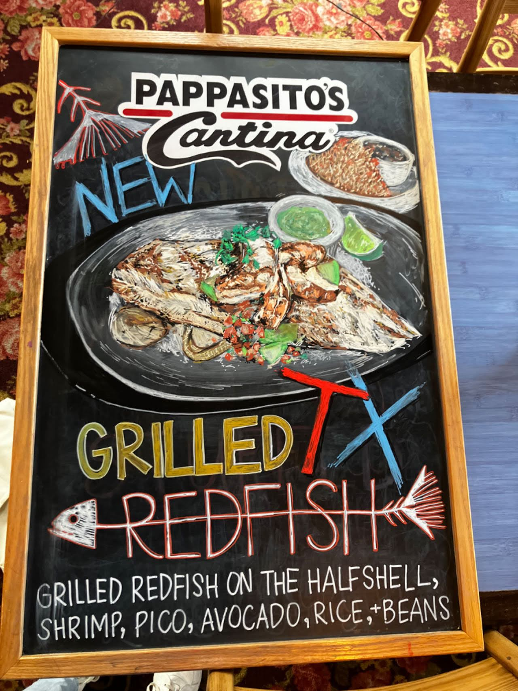   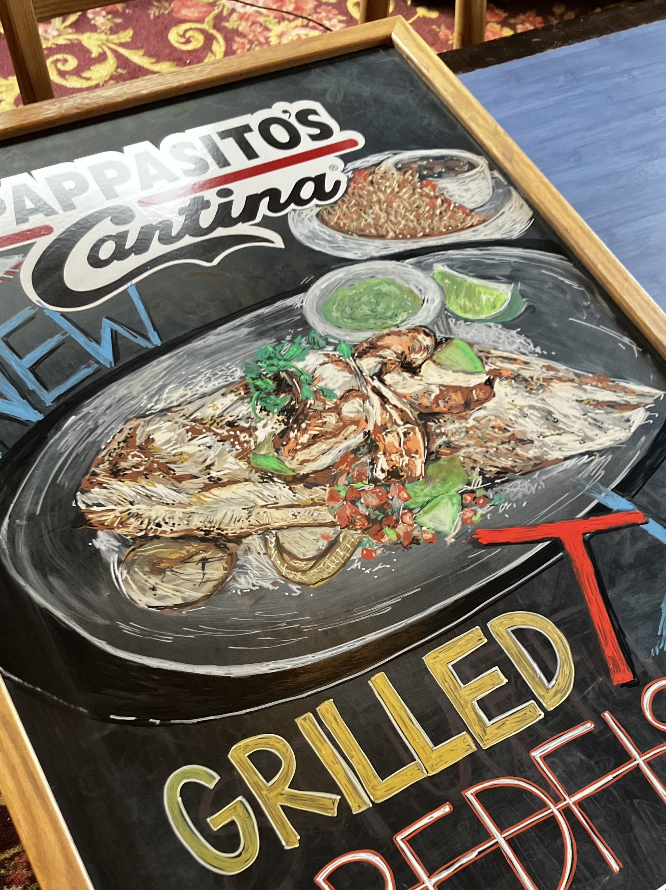   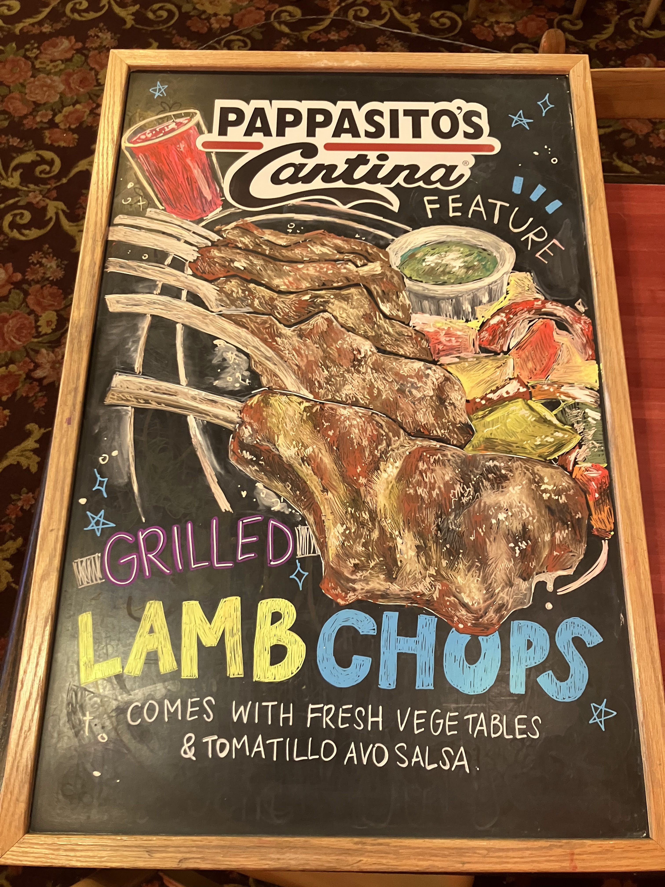  
  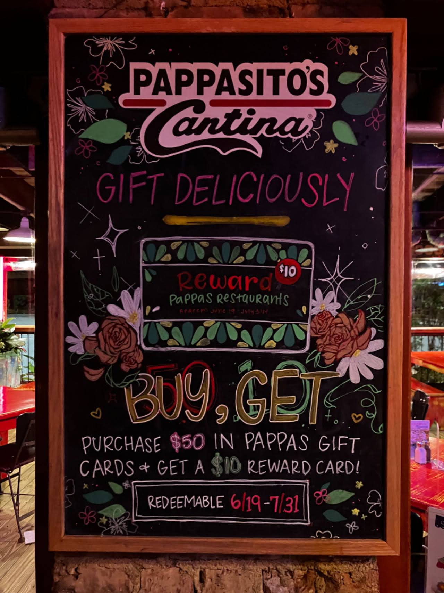   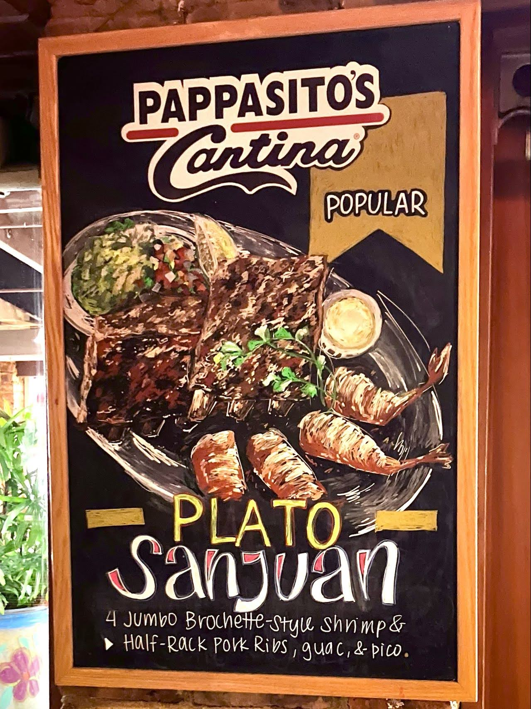   

  <h2 align="center">Open for Inquiries at guanyigrace@gmail.com</h2>

Rates: $0.25-0.50/sq in of chalkboard (varies with detail) | Payment accepted through cash, Zelle, or gift card | Chalk markers provided

Examples are my work from Pappasito's Cantina, Sugar Land, 2023.

---
<h2 align="center">𝑺𝑲𝑬𝑻𝑪𝑯𝑩𝑶𝑶𝑲</h2>

          
          
           
  

---

<h2 align="center">𝑷𝑨𝑰𝑵𝑻</h2>

     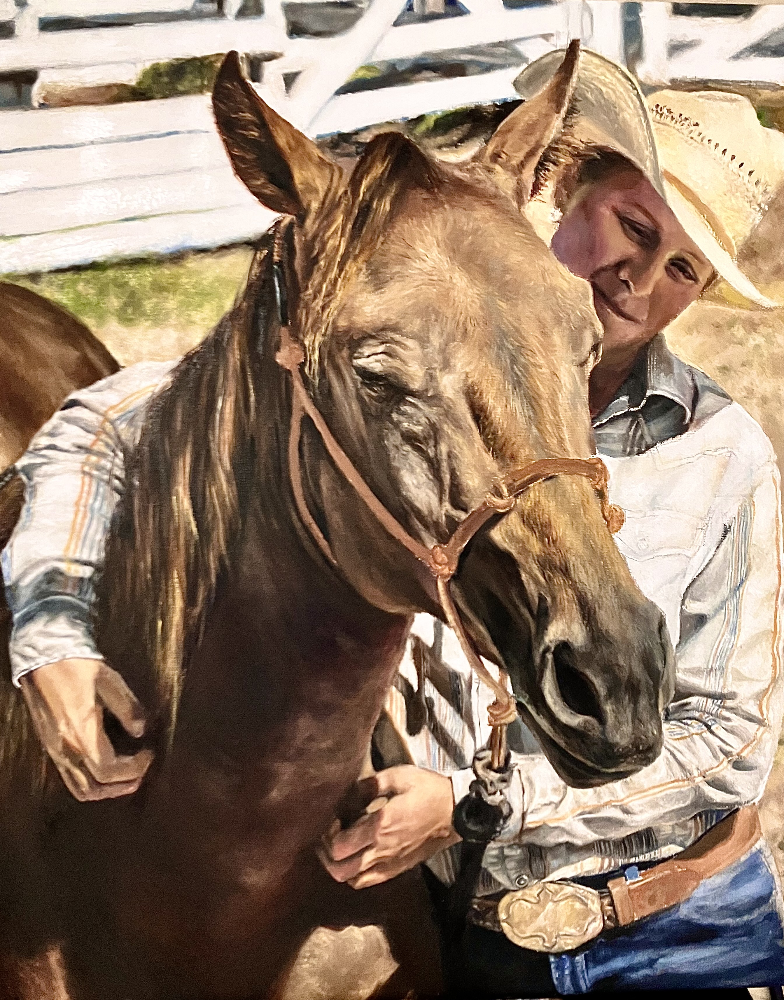     
        

---

<h2 align="center">𝑴𝑶𝑵𝑶𝑪𝑯𝑹𝑶𝑴𝑬 </h2>

          
     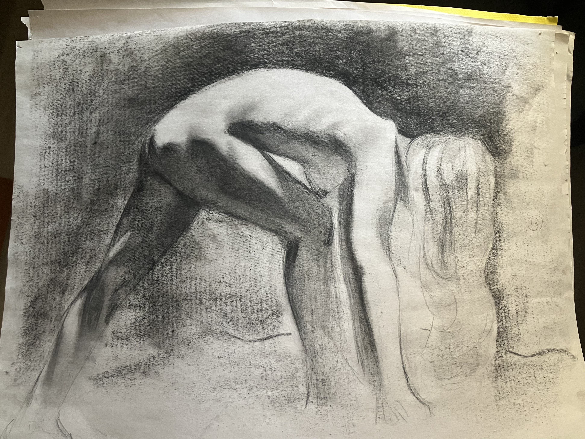   

---

<h2 align="center">𝑫𝑰𝑮𝑰𝑻𝑨𝑳</h2>

         
  

---

<h2 align="center">𝑭𝑳𝑰𝑪𝑲𝑺</h2>

  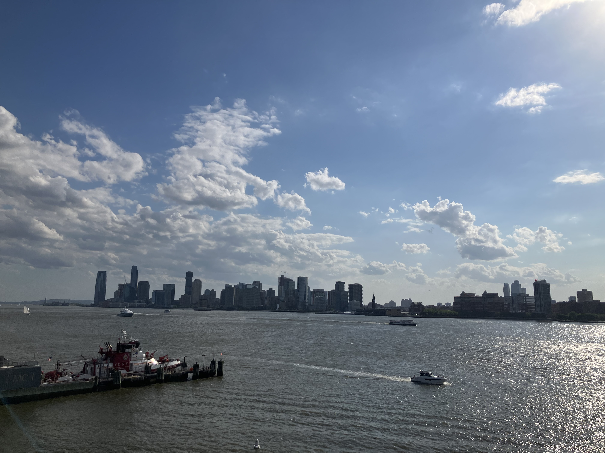      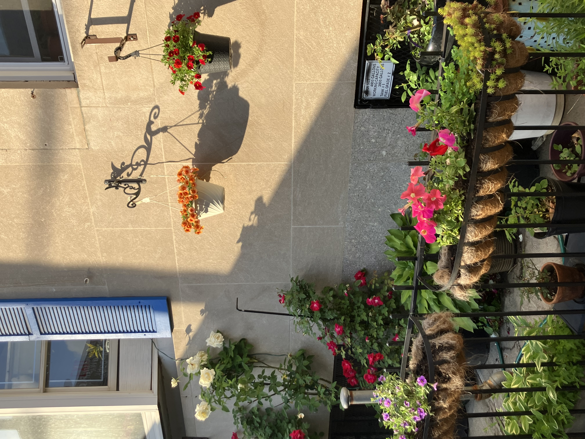  
  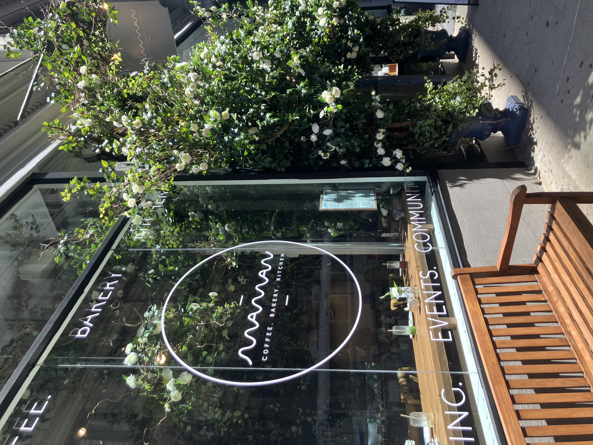   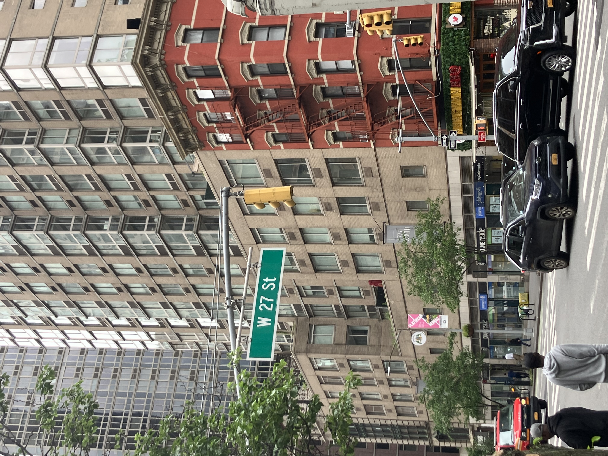   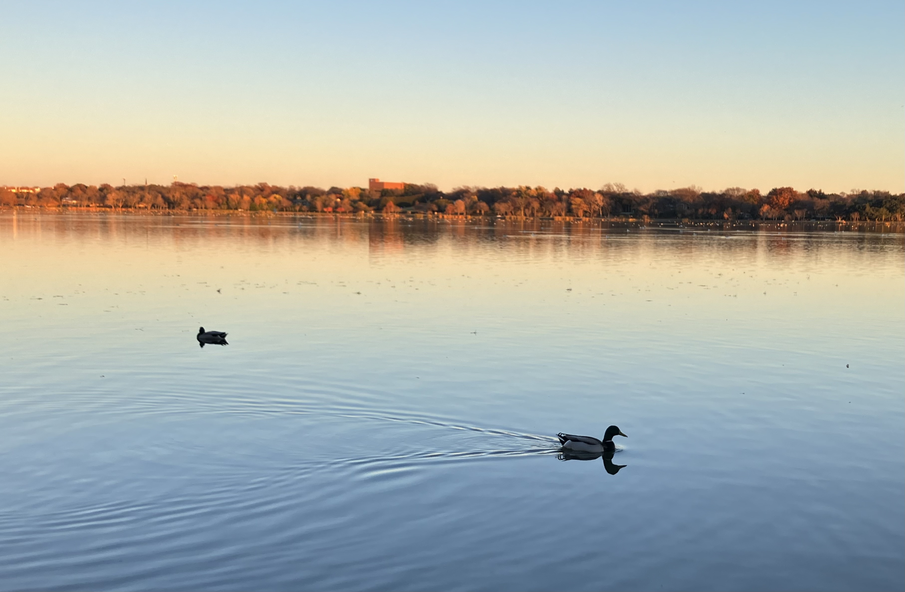

---

<h2 align="center">𝑨𝑩𝑶𝑼𝑻</h2>

  

  <table style="border: none;">
    <tr>
      <td width="30%" align="center" style="border: none;">
        
      </td>
      <td width="60%" align="left" style="border: none;">
        

          Howdy! My name is Guanyi Grace Li, a 19 year old junior at Texas A&M University pursuing 
          a BBA in Accounting and MS in Financial Management.
          More excitingly, I'm also completing a minor in Studio Art, a subject I've loved forever.
          Aside from reading and going on long walks, art is my favorite creative side quest, 
          and it's definitely been the one I've been doing the longest. 
          This website's purpose is to document my hobby so I can look back on my favorite pieces, skill development, and progression.
        

      </td>
    </tr>
  </table>

  

<h2 align="center">𝑪𝑶𝑵𝑻𝑨𝑪𝑻</h2>

  Open to business inquiries at guanyigrace@gmail.com 

---

  <em>Thank you for visiting, I hope to see you again!</em> 

